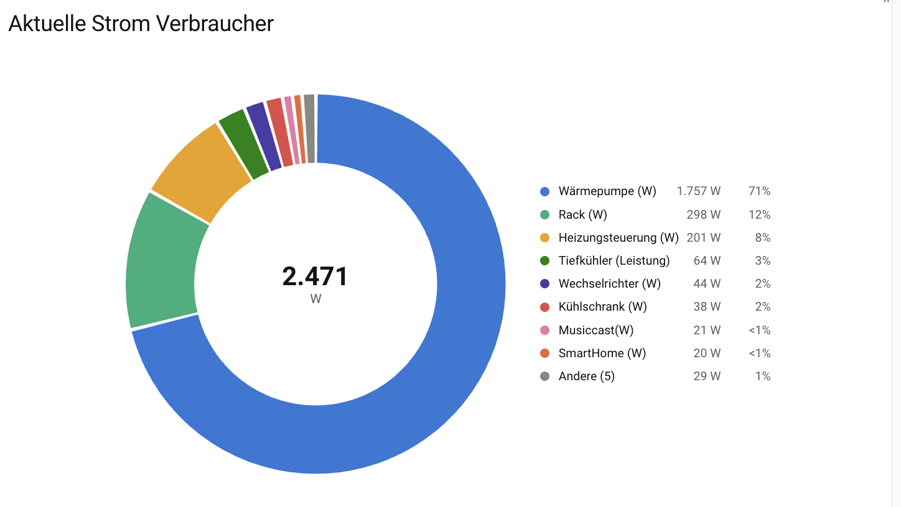
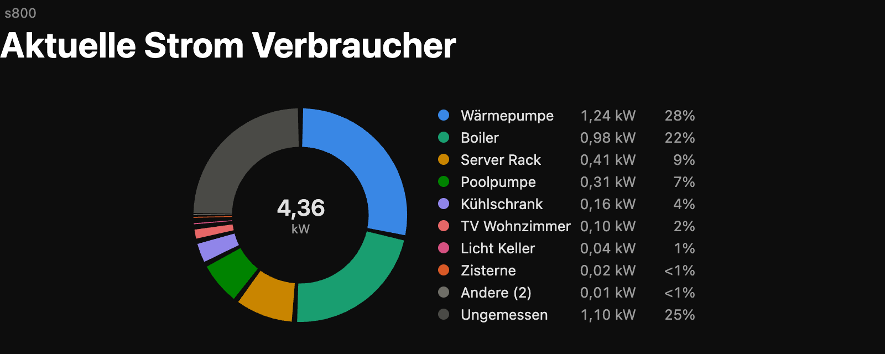
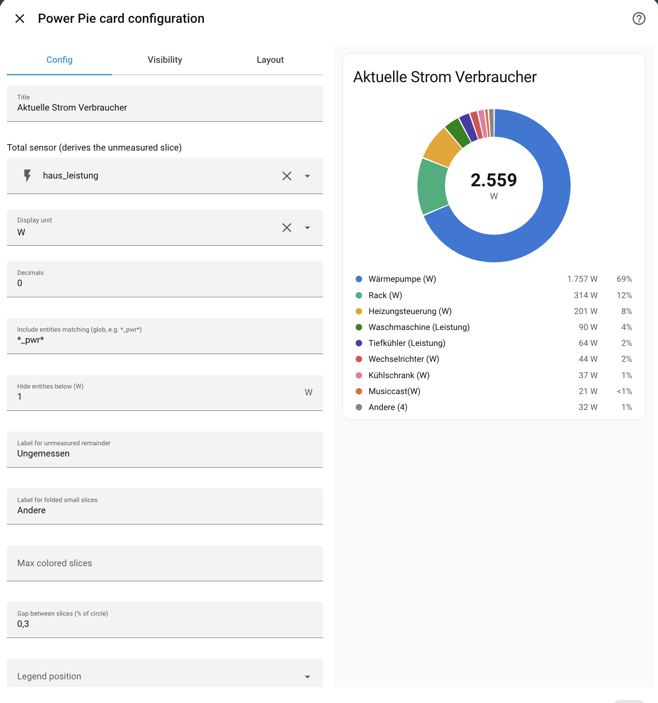

# power-pie-card

A dependency-free doughnut chart card for Home Assistant — built as a modern
replacement for the unmaintained `pie-chart-card`, with entity filtering built in
(no `auto-entities` wrapper needed).



Dark theme:



## Why

The original `pie-chart-card` re-creates its whole Chart.js instance on every
state change (so the chart flickers and resets while you try to read it), hard-codes
its height to 480 px (so it overflows on mobile), and loads Chart.js 2.9 from a CDN
at runtime. This card fixes all of that:

- **Zero dependencies** — one self-contained ES module, SVG rendering, no CDN, no build.
- **Calm updates** — re-renders only when a *displayed* value actually changes, and
  **freezes while you hover or touch** the card (a small ⏸ appears; it catches up the
  moment you leave).
- **Responsive** — fills whatever space the dashboard gives it; legend moves beside
  the chart on wide cards, below it on narrow ones. Works with `grid_options` and
  sections layouts.
- **Real legend** — sorted max→min with value and percentage; hover to highlight the
  slice; click to open the entity's more-info dialog.
- **Built-in filtering** — auto-entities-style include/exclude rules (glob or regex
  entity_id, domain, area, state comparisons).
- **Stable, CVD-safe colors** — a validated 8-hue palette with light/dark variants;
  colors stick to entities (they don't shuffle when the sort order changes), and
  slices beyond 8 fold into an "Other" group instead of cycling hues.
- **Unit-aware** — mixes W and kW source sensors correctly; displays everything in
  one unit of your choice.

## Installation

### HACS (custom repository)

1. HACS → Custom repositories → add `stefanschaedeli/power-pie-card`, category *Dashboard*.
2. Install **Power Pie Card**, reload resources when prompted.

### Manual

Copy `power-pie-card.js` to `/config/www/` and add a dashboard resource:

```yaml
url: /local/power-pie-card.js
type: module
```

## Configuration

The card has a **visual editor** (dashboard → edit card): all options are editable via
GUI fields, including the filter for the common case (one include glob + a
"hide below N W" threshold). Filters too complex for the simple fields — multiple
include rules, area/domain rules, non-threshold excludes — show up as a structured
object sub-editor instead, without losing anything.



YAML reference:

```yaml
type: custom:power-pie-card
title: Aktuelle Strom Verbraucher
total_amount: sensor.haus_leistung   # entity or number; derives an "unmeasured" slice
unknown_text: Ungemessen             # label for the unmeasured remainder
other_text: Andere                   # label for folded small slices
display_unit: kW                     # W | kW — one unit for total, legend, tooltips
filter:
  include:
    - entity_id: "*_pwr*"            # glob; /^sensor\.x/ regex also works
  exclude:
    - state: "< 1"
```

| Option | Default | Description |
|---|---|---|
| `filter.include` | — | List of rules; an entity matching **any** rule is included. Rule keys: `entity_id` (glob or `/regex/`), `domain`, `area` (id or name), `state` (comparison or literal). All keys in one rule must match. |
| `filter.exclude` | — | Same rule syntax; matching entities are dropped. Unavailable / unknown / non-numeric states are always dropped automatically. |
| `entities` | — | Optional static list (`entity_id` strings or `{entity, name, color}`), merged with filter results. Old pie-chart-card configs keep working. |
| `title` | — | Card header (omit for a headless card). |
| `total_amount` | sum of slices | Entity id or number. If larger than the measured sum, the rest becomes a gray remainder slice. |
| `unknown_text` | `Unknown` | Remainder slice label (`unknownText` also accepted). |
| `other_text` | `Other` | Label for slices folded beyond `max_slices`. |
| `display_unit` | `W` | `W` or `kW`; applied uniformly everywhere. |
| `decimals` | 0 (W) / 2 (kW) | Fraction digits for displayed values. |
| `sort` | `max` | `max` (largest first) or `none` (input order). |
| `slice_gap` | `0.8` | Gap between slices, in % of the circle circumference (0–5; 0 = touching slices). |
| `legend` | `auto` | Legend position: `auto` (beside the chart on wide cards, below on narrow), `top`, `bottom`, `left`, `right`, or `none` (hidden). |
| `max_slices` | 8 | Colored slices before folding into "Other" (8 is also the palette maximum — hues are never cycled). |

### Notes

- Source sensors may mix `W` and `kW` (`unit_of_measurement` is respected);
  everything is converted internally and displayed in `display_unit`.
- Colors are assigned per entity for the lifetime of the card and released when an
  entity leaves the set. Pin a color permanently with a static entry:
  `entities: [{entity: sensor.boiler_pwr, color: "#4a3aa7"}]`.
- Updates pause while a mouse pointer is over the card, and for 10 s after a touch.

## Development

Open `dev/index.html` in a browser (serve the folder or launch Chrome with
`--allow-file-access-from-files`) — it renders the card at three sizes against a
mocked, churning `hass` object with light/dark toggles.

## Acknowledgments

Thanks to [sdelliot](https://github.com/sdelliot) — the original
[pie-chart-card](https://github.com/sdelliot/pie-chart-card) inspired this card and
served its users well for years. power-pie-card started as its spiritual successor
and keeps its configuration (`entities`, `title`, `total_amount`, `unknownText`)
working unchanged.

## License

MIT
